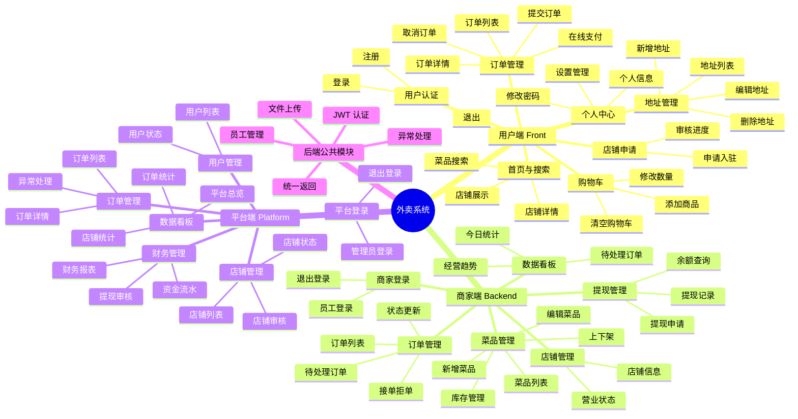

```mermaid
mindmap
  root((外卖系统))
    
    用户端 Front
      用户认证
        登录
        注册
        退出
      首页与搜索
        店铺展示
        菜品搜索
        店铺详情
      购物车
        添加商品
        修改数量
        清空购物车
      订单管理
        提交订单
        订单列表
        订单详情
        在线支付
        取消订单
      地址管理
        地址列表
        新增地址
        编辑地址
        删除地址
      个人中心
        个人信息
        修改密码
        设置管理
      店铺申请
        申请入驻
        审核进度
    
    商家端 Backend
      商家登录
        员工登录
        退出登录
      数据看板
        待处理订单
        今日统计
        经营趋势
      菜品管理
        菜品列表
        新增菜品
        编辑菜品
        上下架
        库存管理
      订单管理
        订单列表
        待处理订单
        接单拒单
        状态更新
      店铺管理
        店铺信息
        营业状态
      提现管理
        余额查询
        提现申请
        提现记录
    
    平台端 Platform
      平台登录
        管理员登录
        退出登录
      数据看板
        平台总览
        店铺统计
        订单统计
      店铺管理
        店铺列表
        店铺审核
        店铺状态
      订单管理
        订单列表
        订单详情
        异常处理
      用户管理
        用户列表
        用户状态
      财务管理
        资金流水
        提现审核
        财务报表
    
    后端公共模块
      员工管理
      文件上传
      JWT 认证
      异常处理
      统一返回
```

---
